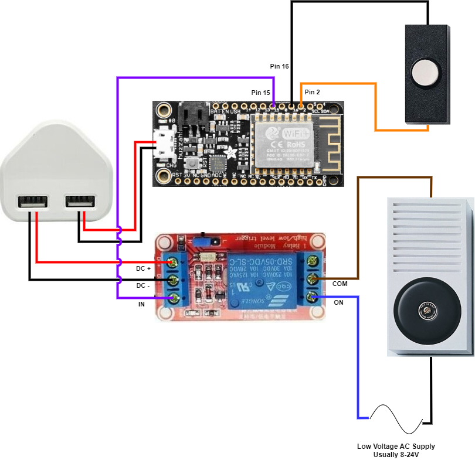

# Stealth Smart Doorbell

This project can be used to make a traditional doorbell "smart" with Arduino, Adafruit, ESP8266 and Home Assistant

I have included the following:

- Code for Arduino
- Circuit diagram
- 3D printer files (a case to hold the ESP8266 board and Relay board)

## Overview

Retain the original button and bell but intercept the traditional "button push" with an Arduino device. 

Once a button push happens, the following events occur:
- Trigger a momentary relay to turn on the original bell or chime (usually a low voltage AC power device)
- Send an event to Home Assistant via the MQTT broker
- Perform Home Assistant automations (such as send message to your phone)

## Components / Shopping List

These are components that I used, but I'm sure many alternatives are available

- [Adafruit Feather HUZZAH ESP8266](https://learn.adafruit.com/adafruit-feather-huzzah-esp8266)
- [5V Relay Module, Opto-coupler isolated](https://www.ebay.co.uk/itm/164736285470)
- 5v USB wall charger
- Terminal strip/block (or Wago or Ideal connectors)
- JST male and female connectors (to easily remove/isolate the Arduino and relay from the circuit in case of problems)

## Circuit Diagram

## Photos
